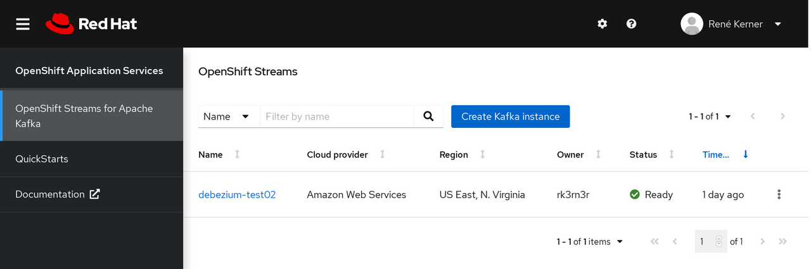

= Debezium and Apache Camel with Red Hat Managed Kafka

This demo for Red Hat Managed Kafka will show how to replicate data and
data changes from a Postgres database with Debezium into a MySQL db
using a Camel SQL Kafka Connector.

:toc:

== Prerequisites

To run this demo you need to have an OpenShift cluster up and running and
a user with sufficient rights on that cluster.

=== Login

You maybe need to update the api endpoint for your Openshift cluster and
provide a valid username.

[source,console]
----
oc login https://api.cluster-daft.punk.example.opentlc.com:6443 -u <CLUSTER-USER-NAME>
----

=== Setup Project `dbz-mk-demo`

Setup a namespace for this example, e.g. this demo uses "dbz-mk-demo":

[source,console]
----
oc new-project dbz-mk-demo --display-name="Debezium Managed Kafka Demo"

oc project dbz-mk-demo
----

=== Setup Red Hat Container Registry Secret

For downloading the AMQ Streams Kafka container image in the next step,
a Registry Service Account must be created on the Red Hat Customer Portal
in the https://access.redhat.com/terms-based-registry/[Registry Service Accounts]
section.

The secret must be named `debezium-demo-registry-secret`. An example
would look like that:

[source,properties,title='00-redhat-registry-secret.yaml']
----
include::00-redhat-registry-secret.yaml[]
----

It is referenced in the AMQ Streams YAML file of this demo:

[source,properties,title='01-amq-streams.yaml']
----
include::01-amq-streams.yaml[lines=14961..14962]
----

The *updated* _00-redhat-registry-secret.yaml_ file can then be applied:

[source,console]
----
oc apply -f 00-redhat-registry-secret.yaml -n dbz-mk-demo
----

== Quick Run

To just quickly run this demo you'll need:

. to <<Create a Custom AMQ Streams Kafka Connect Image, create a custom AMQ Streams Kafka Connect container image>>

. to <<Create Database Secrets for Connectors, create secrets with database credentials>>

. update `04-kafka-connect-sasl.yaml` and `05-kafka-connect-oauth.yaml`:

** with the coordinates to the previously created custom
AMQ Streams Kafka Connect container image on the `image` property

** set the `bootstrapServers` property for your Manage Kafka cluster

** set `username`(SASL_SSL) / `clientId`(OAUTH) to the Manage Kafka username

** for OAUTH also set `tokenEndpointUri` to your OAUTH token endpoint

. apply all *updated* YAML files in this demo directory in the right
order, according to the filename prefix

== Detailed Walkthrough

=== Install AMQ Streams (Strimzi Operator)

[NOTE]
====
In order to add Strimzi Operator the user needs to have right to add
CustomResourceDefinition objects.
====

[source,console]
----
oc apply -f 01-amq-streams.yaml -n dbz-mk-demo
----

For further installation options, like using the OpenShift OperatorHub,
look at https://access.redhat.com/documentation/en-us/red_hat_amq/2020.q4/html/deploying_and_upgrading_amq_streams_on_openshift/deploy-intro_str#con-streams-installation-methods_str[AMQ Streams installation methods].

=== Setup demo databases

This demo uses the Debezium PostgreSQL Example database, and an empty
MySQL database as destination.

[source,console]
----
oc apply -f 02-databases.yaml -n dbz-mk-demo
----

That config sets `postgres` as username and also `postgres` as password
for the PostgreSQL db:

[source,yaml]
----
include::02-databases.yaml[lines=45..58]
----

For the MySQL db the username is set to `mysql` and the password
will also be `mysql`:

[source,yaml]
----
include::02-databases.yaml[lines=104..118]
----

[NOTE]
====
The additional `args` config solves a possible issue on MySQL startup
where the mounted volume is not completely empty because the filesystem
already has a `lost+found` directory (depends on the underlying filesystem).
====

=== Create Database Secrets for Connectors

In this demo database credentials won't be provided in the Kafka connector
config directly, as they might be unknown to users that setup a connector.

Instead we use two java `.properties` files as secrets:

[source,properties,title='debezium-postgres-credentials.properties']
----
include::debezium-postgres-credentials.properties[]
----

[source,properties,title='debezium-mysql-credentials.properties']
----
include::debezium-mysql-credentials.properties[]
----

And add them as a generic secret in order to reference them later in
the KafkaConnector resources:

[source,console]
----
oc create secret generic debezium-postgres-credentials --from-file=debezium-postgres-credentials.properties -n dbz-mk-demo

oc create secret generic debezium-mysql-credentials --from-file=debezium-mysql-credentials.properties -n dbz-mk-demo
----

=== Create a Custom AMQ Streams Kafka Connect Image

Build and push a custom container image for AMQ Streams Kafka Connect:

* Install `camel-sql-kafka-connector` package and Debezium connectors

* Add MySQL and PostgreSQL drivers into the `camel-sql-kafka-connector` directory

* Add `camel-debezium-common` jar into the `camel-sql-kafka-connector` directory

A Dockerfile that uses Debezium connectors from the community version of the
Debezium container image looks like that:
// This sections needs rework when the S2I process and custom image process etc is officially replaced!

[source,dockerfile,title='Dockerfile']
----
include::Dockerfile[]
----

=== Setup Managed Kafka

Create a Managed Kafka cluster, if you don't have a cluster yet:

Then create a secret in OpenShift with the password for your Managed
Kafka cluster:

[source,yaml,title='03-kafka-secret.yaml']
----
include::03-kafka-secret.yaml[]
----

The *updated* _03-kafka-secret.yaml_ file can then be applied:

[source,console]
----
oc apply -f 03-kafka-secret.yaml -n dbz-mk-demo
----

=== Setup Kafka Connect with Strimzi

This demo shows two ways of how to connect Kafka Connect to
Red Hat Managed Kafka, one with SASL_SSL authentication, the
other with OAUTH / SASL_OAUTHBEARER.

SASL_SSL authentication is configured like this:

[source,yaml,title='04-kafka-connect-sasl.yaml']
----
include::04-kafka-connect-sasl.yaml[lines=13..21]
----

OAUTH based SASL_OAUTHBEARER authentication is configured like this:

[source,yaml,title='05-kafka-connect-oauth.yaml']
----
include::05-kafka-connect-oauth.yaml[lines=13..24]
----

The Managed Kafka password is referenced from the
previously created secret `debezium-demo-kafka-secrets` by the
secret key `kafka.password`, which is the key of the password
inside that secret.

[NOTE]
====
You need to update coordinates for your previously created custom
AMQ Streams Kafka container image for Kafka Connect on the `image`
property, Manage Kafka cluster on the `bootstrapServers` property
and `username`(SASL_SSL)/`clientId`(OAUTH), and for OAUTH also update
`tokenEndpointUri` for the OAUTH token endpoint.
====

The previoulsy created secrets with the database credentials
(properties files) are referenced in the `externalConfiguration`
section:

[source,yaml]
----
  externalConfiguration:
    volumes:
      - name: postgres-connector-credentials
        secret:
          secretName: debezium-postgres-credentials
      - name: mysql-connector-credentials
        secret:
          secretName: debezium-mysql-credentials
----

The *updated* `04-kafka-connect-sasl.yaml` and `05-kafka-connect-oauth.yaml`
files can then be applied:

[source,console]
----
oc apply -f 04-kafka-connect-sasl.yaml -n dbz-mk-demo

oc apply -f 05-kafka-connect-oauth.yaml -n dbz-mk-demo
----

[NOTE]
====
It's necessary to provide an empty array for
the `tls.trustedCertificates` property.
This will enable SASL_SSL mode, instead of the unencrypted
SASL_PLAIN mode with AMQ Streams.

The empty array means that it will be using the default TLS
certificates of the JVM.
====

=== Start Debezium Postgres Source Connector

Finally, it's time to start the Debezium Postgres Source Connector.

The YAML config points to the previously created PostgreSQL instance.

`database.user` and `database.password` are referenced from the
properties files in the secrets previously created in the
<<Create Database Secrets for Connectors>> section.

[source,yaml,title='06-debezium-connector-source.yaml']
----
include::06-debezium-connector-source.yaml[lines=10..]
----

And apply that config:

[source,console]
----
oc apply -f 06-debezium-connector-source.yaml -n dbz-mk-demo
----

=== Check Messages in Managed Kafka

When you have a Kafka distribution installed that includes
`kafka-console-consumer.sh`, you can check if messages from
Debezium successfully arrived on the Manage Kafka cluster.

First, update `managed-kafka.properties` file and set the right values
for the placeholders `${MK_BOOTSTRAP_SERVERS}`, `${MK_USERNAME}` and
`${MK_PASSWORD}`:

[source,properties,title='managed-kafka.properties']
----
include::managed-kafka.properties[]
----

Now check if messages arrived in the Change Data Capture (CDC) Kafka topics
that were created by Kafka Connect:

[source,console]
----
kafka-console-consumer.sh --bootstrap-server debezium-t--opl--t-kraa-dl-daft-punk.kafka.openshift.org:443 \
--consumer.config managed-kafka.properties --from-beginning --whitelist 'postgres1\..*'
----

=== Start Apache Camel SQL Kafka Sink Connector

Now it's time to connect to that MySQL instance which was created
earlier and create a MySQL database with the name `replicated_inventory`,
and also setup a `products` table in that schema (use MySQL user: `root`
with password `debezium` to create the new database and table and
grant permissions):

[source,sql]
----
CREATE DATABASE replicated_inventory;

GRANT ALL PRIVILEGES ON replicated_inventory.* TO 'mysql'@'%';

USE replicated_inventory;

CREATE TABLE products (
  id INTEGER NOT NULL AUTO_INCREMENT PRIMARY KEY,
  name VARCHAR(255) NOT NULL,
  description VARCHAR(512),
  weight FLOAT
);
----

For the configuration of the Apache Camel SQL Kafka Sink Connector
`camel.component.sql.dataSource.user` and
`camel.component.sql.dataSource.password` are also referenced from the
properties files in the secrets previously created in the
<<Create Database Secrets for Connectors>> section.

Data shoudld be read from the Kafka topic of the `products` table,
which is `postgres1.inventory.products`.

The connector will apply Debezium's `ExtractNewRecordState`
Single-Message-Transform (SMT) and use the provided MySQL
query to write messages into that `replicated_inventory.products`
table.

[source,yaml,title='07-camel-connector-sink.yaml']
----
include::07-camel-connector-sink.yaml[lines=10..]
----

Applying that config to start the Camel SQL Kafka Sink Connector:

[source,console]
----
oc apply -f 07-camel-connector-sink.yaml -n dbz-mk-demo
----

=== Validating Data Arrived in MySQL

Now connect to the MySQL instance and check if data successfully
arrived in the replicated table:

[source,sql]
----
SELECT * FROM replicated_inventory.products;

# +-----+--------------------+---------------------------------------+--------+
# | id  | name               | description                           | weight |
# +-----+--------------------+---------------------------------------+--------+
# | 101 | scooter            | Small 2-wheel scooter                 |   3.14 |
# | 102 | car battery        | 12V car battery                       |    8.1 |
# | 103 | 12-pack drill bits | 12-pack of drill bits                 |    0.8 |
# | 104 | hammer             | 12oz carpenter's hammer               |   0.75 |
# | 105 | hammer             | 14oz carpenter's hammer               |  0.875 |
# | 106 | hammer             | 16oz carpenter's hammer               |      1 |
# | 107 | rocks              | box of assorted rocks                 |    5.3 |
# | 108 | jacket             | water resistent black wind breaker    |    0.1 |
# | 109 | spare tire         | 24 inch spare tire                    |   22.2 |
# +-----+--------------------+---------------------------------------+--------+
# 9 rows in set (0.01 sec)
----
